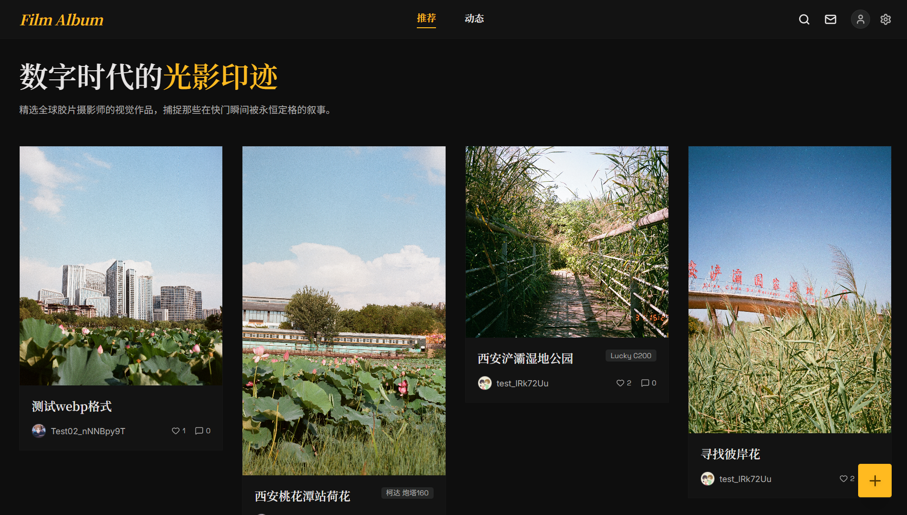
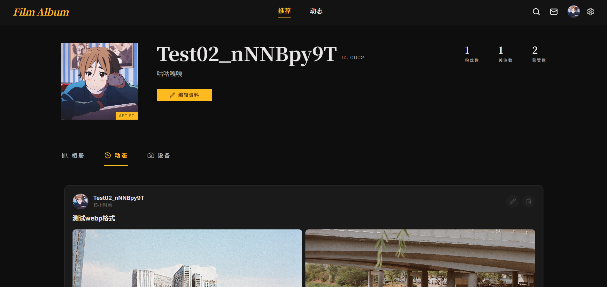
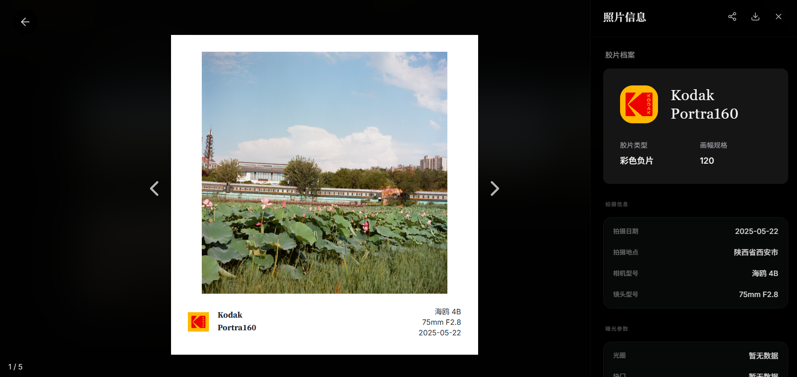

<div align="center">
  
  <br/><br/>
  
  
  
  
  
  <br/>
  
</div>

# 居流相册 (Film Album)

> **属于胶片摄影师的数字角落。让每一卷底片，都在数字世界找到最美的一站。**

居流相册（Film Album）是一款专为胶片摄影爱好者打造的社交与管理平台。它不仅是一个展示作品的舞台，更是一个全方位的胶片档案管理系统，从镜头型号到扫描参数，完整记录光影背后的每一份细节。

---

## 🌟 项目亮点

*   **🎬 数字化观片台**：模拟传统灯箱观片体验，以胶片长条形式展示整卷底片，支持帧位调整与 EXIF 式元数据记录。
*   **🖼️ 极速视觉流**：主页采用智能瀑布流布局。全面适配 **WebP 预览图技术**，在保证画质的同时实现毫秒级首屏加载。
*   **📷 设备与胶卷库**：内置设备管理模块，追踪相机、镜头的使用频率；支持自定义胶卷型号库，涵盖从 Kodak Portra 到 Cinestill 的全线档案。
*   **🎨 精美边框导出**：一键生成带有品牌 Logo、拍摄参数及边框的视觉长图，完美适配社交媒体分享。
*   **🤝 社区互动**：关注你喜爱的摄影师，点赞、评论、分享，在胶片的世界里不再孤单。
*   **🛡️ 分级权限系统**：三级用户权限（LV1 只读 / LV2 标准 / LV3 无限），通过隐藏后台灵活管理。

---

## 🛠️ 技术栈

### 前端 (Frontend)
- **核心框架**: React 19 + TypeScript
- **构建工具**: Vite 6
- **样式方案**: TailwindCSS 4 + Vanilla CSS
- **动画库**: Framer Motion (motion/react)
- **路由**: React Router 7

### 后端 (Backend)
- **运行环境**: Cloudflare Workers
- **Web 框架**: Hono
- **数据库**: Cloudflare D1 (SQLite-based)
- **鉴权**: JWT (JSON Web Token)
- **图片处理**: 智能 WebP 压缩流

---

## 🚀 部署指南 (Deployment Guide)

项目采用全栈 **Cloudflare** 方案，部署成本接近 **￥0**。请按照以下步骤依次操作：

### 1. 准备工作
在开始之前，你需要准备好以下服务：
- [Cloudflare 账号](https://dash.cloudflare.com/)：用于托管前端、后端及数据库。
- [Resend 账号](https://resend.com/)：用于发送邮箱验证码，免费额度充足，注册后获取 **API Key**。
- [CloudFlare-ImgBed 图床](https://github.com/marlowe-j/cloudflare-imgbed)：建议自建图床，获取 **URL** 和 **API Token**。

---

### 2. 后端部署 (Cloudflare Workers + D1)

#### 2.1 创建并初始化数据库
1.  **安装依赖**：
    ```bash
    cd backend
    npm install
    ```
2.  **创建 D1 数据库**：
    ```bash
    npx wrangler d1 create film-album-db
    ```
    *执行后，请记下返回结果中的 `database_id`。*
3.  **修改配置**：打开 `backend/wrangler.toml`，将 `[[d1_databases]]` 部分的 `database_id` 替换为你刚才获取的 ID。
4.  **初始化表结构**：
    ```bash
    npx wrangler d1 execute film-album-db --remote --file=./src/db/schema.sql
    ```

#### 2.2 录入必要的密钥 (Secrets)

只需要录入 **1 个密钥** 即可完成部署，其余所有配置均在后台 UI 中完成：

```bash
npx wrangler secret put ADMIN_PASSWORD   # 超级管理员后台的登录密码
```

> **关于 `JWT_SECRET`**：系统会自动由 `ADMIN_PASSWORD` 派生一个确定性的签名密钥，**无需手动配置**。如果你有更高的安全要求，也可以额外单独设置 `JWT_SECRET`。

#### 2.3 部署代码
```bash
npx wrangler deploy
```
*完成后，你会得到一个后端 API URL（例如：`https://film-api.xxx.workers.dev`）。*

---

### 3. 前端部署 (Cloudflare Pages)

1.  **Fork 并关联**：将本项目 Fork 到你的 GitHub，在 Cloudflare Pages 中点击 "Create a project" -> "Connect to git"。
2.  **构建配置**：
    -   **Framework preset**: `Vite`
    -   **Build command**: `npm run build`
    -   **Build output directory**: `dist`
3.  **配置环境变量 (Environment Variables)**：在 Pages 设置中添加：
    -   `VITE_API_BASE_URL`: 填写你上面部署好的后端 URL，**必须以 `/api` 结尾**。
    -   *(例: `https://film-api.xxx.workers.dev/api`)*

---

### 4. 关键：解决 Cookie 登录失效 (域名绑定)

**⚠️ 重要注意：**
由于浏览器对三方 Cookie 的限制，如果前端和后端域名不一致（例如一个是 `pages.dev`，一个是 `workers.dev`），会导致无法保持登录。

**【推荐方案】绑定二级域名：**
1.  在 Cloudflare 中，为你的顶级域名（例如 `example.com`）配置：
    -   **前端**：绑定到 `example.com` 或 `www.example.com`。
    -   **后端**：在 Workers 设置的 "Custom Domains" 中添加 `api.example.com`。
2.  **更新环境变量**：将前端 Pages 的 `VITE_API_BASE_URL` 更新为 `https://api.example.com/api`。

完成后，前端和后端将属于"同级域名"，登录状态将持久保持。

---

### 5. 初始化：通过管理员后台完成配置

部署完成后，访问 `https://your-site.com/admin`，使用第 2.2 步设置的 `ADMIN_PASSWORD` 登录。

在后台中你可以完成以下配置，**无需再修改任何代码或命令行**：

| 配置项 | 说明 |
|--------|------|
| 🖼️ **图床配置** | 填写图床地址和 API Token |
| 📧 **邮件配置** | 填写 Resend API Key 和发件人地址，可发测试邮件验证 |
| 👥 **开放注册** | 控制是否允许新用户公开注册 |
| 🌐 **默认语言** | 设置网站全局默认语言（中文 / English） |
| 📁 **LV2 影集上限** | 设置 LV2 用户可创建的影集数量上限 |
| 👤 **用户管理** | 查看所有用户，修改用户等级，手动创建账号 |

---

## 🛡️ 用户权限等级

| 等级 | 权限说明 |
|------|---------|
| **LV1**（默认） | 只读权限：可浏览所有内容，但无法发帖、创建影集、添加设备或评论 |
| **LV2** | 标准权限：可使用全部功能，但影集数量有上限（后台可配置，默认 10 个） |
| **LV3** | 无限制权限：完全解锁，无任何数量限制 |

> 新注册用户默认为 LV1，需要管理员在 `/admin` 后台手动升级等级。

---

## 📸 界面预览

<div align="center">
  
  <br/><br/>
  
  
  <br/><br/>
</div>

---

## 📄 开源协议

本项目采用 [MIT License](LICENSE) 开源协议。

---

<p align="center">由 <b>Antigravity</b> 驱动，用心记录每一格感光面积。</p>
